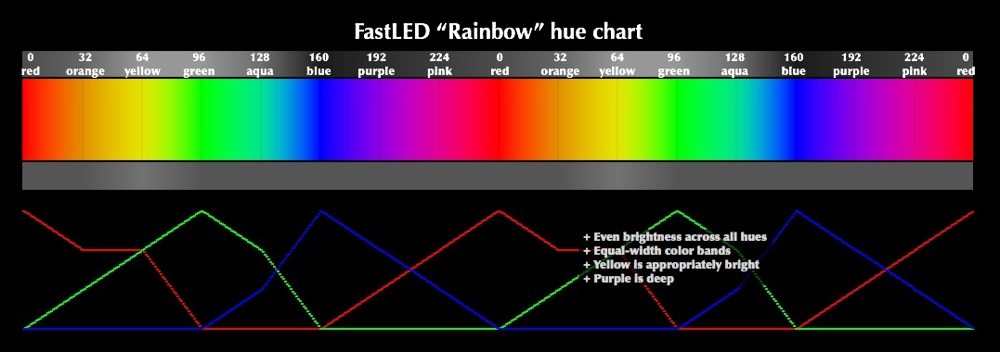
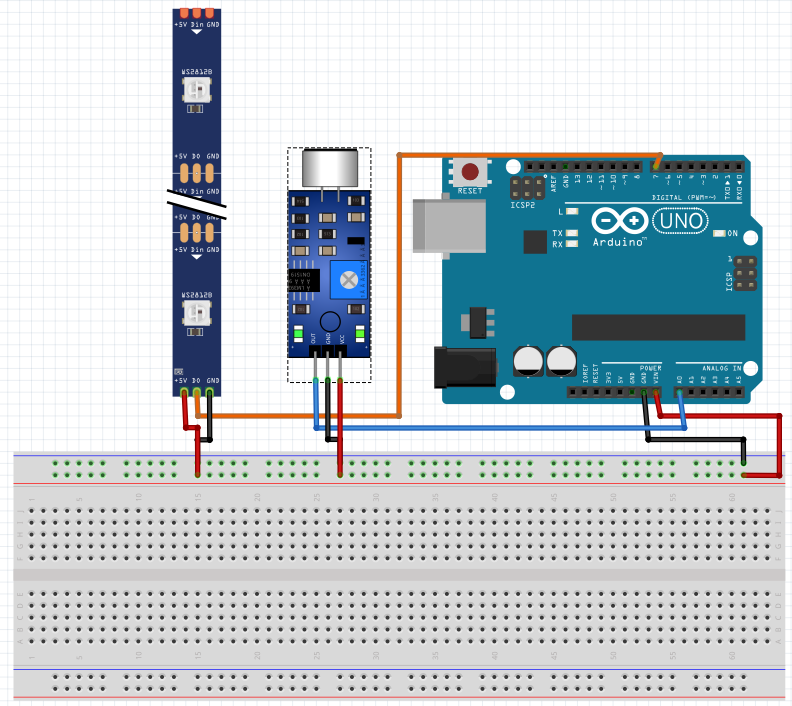

# Cloud-Lamp
Cloud Lamp parts:
 • https://www.direnc.net/arduino-gurultu-ses-algilama-modulu
 • https://www.direnc.net/tekli-breadboard
 • https://urun.n11.com/serit-led/adreslenebilir-serit-led-arduino-ile-uyumlu-12v-rgb-P446433344
 • https://www.direnc.net/arduino-uno-r3-smd
 • https://www.gittigidiyor.com/ev-bahce/30-cm-japon-feneri-kagit-fener-avize-sarkit-dekoratif-cin-feneri_pdp_533861800?urvid=171730120
 • https://www.gittigidiyor.com/ev-bahce/boncuk-tam-silikon-elyaf-1-kg_pdp_632106308

  FastLED Hue Chart:
 • Hue Chart

  

  Cloud Lamp Wire Diagram:
 • Diagram:

  

  Result:
 • Result:

   
   
   

